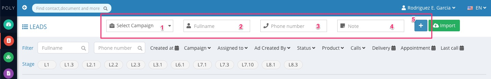
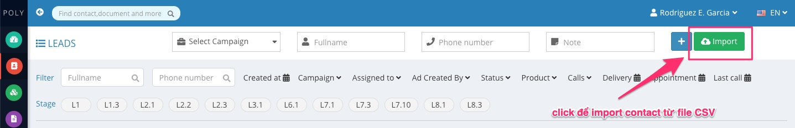
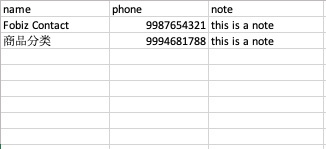
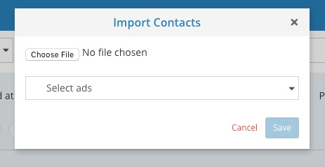

Hiện tại hệ thống Fobiz có 2 cách để thêm mới contact vào hệ thống bao gồm:

- Thêm thủ công để thêm vào từng contact
- Thêm tự động bằng cách import từ file .CSV để tạo hàng loạt contact

#### 1. Thêm thủ công
 Đây là cách đơn giản nhất để thêm mới contact, có thể truy cập tại đầu trang [Danh sách contact](https://admin.fobiz.asia/#/contacts)

 

 Các thông tin cần thiết khi thêm mới contact bao gồm:

 1. Chọn nguồn contact, ở đây là chiến dịch quảng cáo để lấy được thông tin contact
 2. Tên khách hàng
 3. Số điện thoại khách hàng
 4. Ghi chú thêm về khách hàng nếu có (thông tin này là không bắt buộc)

{}
Sau khi thêm mới contact bằng cách thêm thủ công, contact sẽ đc thêm vào nguồn quảng cáo là quảng cáo mặc định của chiến dịch quảng cáo đã chọn ở bước chọn chiến dịch quảng cáo
{}

#### 2. Thêm hàng loạt thông qua import file
Đây là cách nhanh nhất để tạo nhiều contact nếu bạn có nguồn contact nhiều, không thể thêm được từng contact bằng cách thủ công. Có thể truy cập tính năng này tại đầu trang [Danh sách contact](https://admin.fobiz.asia/#/contacts)
 

Để thêm vào bằng cách import, bạn cần chỉnh sửa file CSV theo mẫu có thể download [ở đây](https://fobiz.page.link/import-contact)

Các thông tin có thể nhập vào file này bao gồm:

- name: là tên của khách hàng
- phone: là số điện thoại của khách hàng
- note: là ghi chú liên quan đến khách hàng, thông tin này là ko bắt buộc

 

 Sau khi đã chỉnh sửa file, bạn có thể tiến hành upload file lên hệ thống Fobiz để thêm mới contact. 
 
 Khi thêm contact bằng cách import bạn sẽ cần chọn contact đó sẽ vào quảng cáo nào.
  

