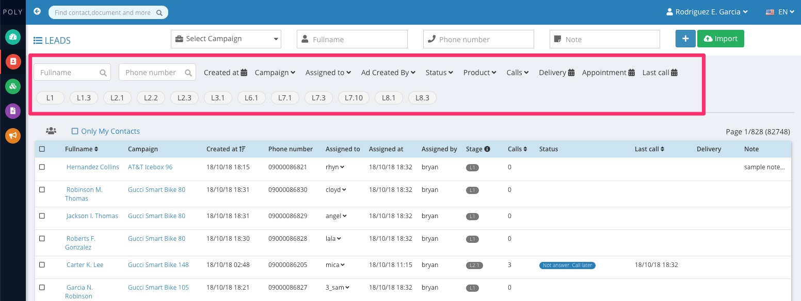

 

Hiện tại hệ thống fobiz hỗ trợ tìm kiếm contact với từ khóa là tên và số điện thoại.

Các bộ lọc có thể sử dụng đi kèm với từ khóa để tìm kiếm tốt hơn bao gồm:

- Trạng thái contact để lọc nhanh các contact với trạng thái nhất định
- Ngày thêm là ngày contact được thêm mới vào hệ thống
- Chiến dịch là chiến dịch sẽ chứa contact đó
- Phụ trách lọc theo telesale hoặc người được phân phụ trách contact
- Người tạo quảng cáo lọc theo người tạo chiến dịch quảng cáo
- Cuộc gọi để lọc theo trạng thái cuộc gọi
- Sản phẩm để lọc theo sản phầm
- Lần gọi để lọc các contact với số lần nhất định
- Hẹn giao để lọc các contact có ngày hẹn giao trong 1 ngày nhất định hoặc 1 khoảng thời gian
- Lịch hẹn để lọc các contact có lịch hẹn gọi lại vào 1 ngày nhất định hoặc 1 khoảng thời gian
- Lần gọi cuối để lọc các contact có lần gọi cuối vào ngày nhất định hoặc khoảng thời gian
